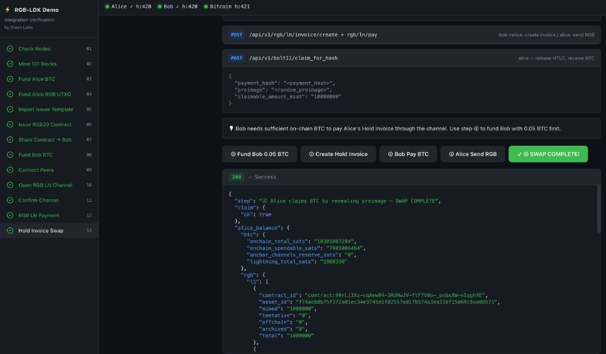

# RGB-LDK Verify Demo



A self-contained local testnet demo that walks through an end-to-end RGB asset issuance and Lightning Network payment flow using **rgbldkd** (RGB-enabled LDK node).

The UI drives every step — check nodes, fund wallets, open an RGB channel, send an RGB Lightning invoice, and verify the final balances — all against a local Bitcoin regtest network running in Docker.

## Architecture

```
Browser (React + Vite)
        │
        ▼  :5173
  Proxy Server (server.mjs)   :3000
   ├── /alice/*  → rgbldkd Alice  :8500
   ├── /bob/*    → rgbldkd Bob    :8501
   └── /bitcoin  → bitcoind RPC   :18443

Docker Compose
  ├── bitcoind          172.18.0.2  :18443
  ├── esplora           172.18.0.3  :3003
  ├── rgb-node-alice    172.18.0.4  :8500 / :9735
  └── rgb-node-bob      172.18.0.5  :8501 / :9736
```

## Prerequisites

| Requirement | Version |
|-------------|---------|
| Docker Desktop | Latest |
| Docker Compose | v2+ (plugin) |
| Node.js | ≥ 18 |

## Important: Passphrase File

`node-passphrase.txt` must exist as a **file** before starting Docker services. If it is missing, Docker will create a directory at the mount point and the nodes will fail to start with `Is a directory (os error 21)`.

The file is not tracked by git. Create it once with any passphrase you choose:

```bash
echo -n "your-passphrase" > node-passphrase.txt
```

> For a local-only demo, a simple string is fine. Do not reuse a real password.

## Quick Start

```bash
# 1. Clone the repo
git clone <repo-url>
cd rgb-ldk-verify-demo

# 2. Start everything (Docker stack + Vite dev server)
./start.sh
```

`start.sh` will:

1. Check that Docker and Node.js are installed.
2. Start the Docker services (`bitcoind`, `esplora`, `rgb-node-alice`, `rgb-node-bob`).
3. Wait for all services to become healthy.
4. Run `npm install` if `node_modules/` is missing.
5. Start the proxy server and Vite dev server in parallel.
6. Open `http://localhost:5173` in your browser.

## Manual Setup

If you prefer to run each step yourself:

```bash
# Install dependencies
npm install

# Start Docker services
docker compose up -d

# Start proxy + Vite dev server
npm run start
```

Then open `http://localhost:5173`.

## Demo Steps

The UI guides you through the following flow:

| Phase | Step | Description |
|-------|------|-------------|
| **Infra** | Check Nodes | Verify both rgbldkd nodes are running |
| **Infra** | Mine 101 Blocks | Activate coinbase maturity on regtest |
| **Infra** | Fund Alice BTC | Send 1 BTC to Alice's on-chain wallet |
| **RGB** | Import Issuer | Load `RGB20-Simplest-v0-rLosfg.issuer` into Alice |
| **RGB** | Issue Asset | Alice issues an RGB20 token |
| **RGB** | Export to Bob | Transfer the contract consignment to Bob |
| **LN** | Open Channel | Alice opens an RGB-enabled LN channel to Bob |
| **LN** | Confirm Channel | Mine blocks to confirm the funding transaction |
| **LN** | Bob Issues Invoice | Bob generates an RGB HTLC invoice |
| **LN** | Alice Pays | Alice pays the invoice, Bob receives RGB tokens |
| **Verify** | Check Balances | Confirm Alice and Bob final RGB balances |

## Available Scripts

```bash
./start.sh            # Start all services and open browser
./start.sh --reset    # Tear down volumes and restart fresh
./start.sh --pull     # Pull latest Docker images before starting
./start.sh --stop     # Stop all Docker services
./start.sh --status   # Show current service status
```

```bash
npm run dev           # Vite dev server only (port 5173)
npm run server        # Proxy server only (port 3000)
npm run start         # Both in parallel
npm run build         # Production build → dist/
npm run preview       # Preview production build
```

## Service Ports

| Service | Host Port | Description |
|---------|-----------|-------------|
| Vite UI | 5173 | React development server |
| Proxy | 3000 | Node.js API proxy |
| Alice node | 8500 | rgbldkd HTTP API |
| Bob node | 8501 | rgbldkd HTTP API |
| Alice P2P | 9735 | LDK peer-to-peer |
| Bob P2P | 9736 | LDK peer-to-peer |
| bitcoind RPC | 18443 | Bitcoin Core regtest |
| Esplora | 3003 | Block explorer API |

All ports are bound to `127.0.0.1` only.

## Reset

To wipe all state and start fresh:

```bash
./start.sh --reset
# or manually:
docker compose down -v
docker compose up -d
```

## File Structure

```
rgb-ldk-verify-demo/
├── src/
│   ├── main.jsx              # React entry point
│   ├── App.jsx               # Root component
│   ├── steps.jsx             # Demo step definitions
│   ├── index.css             # Global styles
│   ├── api/index.js          # API client helpers
│   ├── store/index.js        # Global state
│   └── components/
│       ├── Sidebar.jsx       # Step navigation
│       ├── UI.jsx            # Shared UI primitives
│       ├── StatePanel.jsx    # Live state inspector
│       └── StatusBar.jsx     # Service health bar
├── server.mjs                # Proxy server (CORS + binary relay)
├── docker-compose.yml        # Local regtest stack
├── start.sh                  # One-click start script
├── index.html                # HTML entry
├── vite.config.js
├── tailwind.config.js
├── postcss.config.js
├── package.json
└── RGB20-Simplest-v0-rLosfg.issuer   # RGB20 issuer fixture
```

## License

Copyright 2026 Stash Labs

Licensed under the Apache License, Version 2.0 (the "License");
you may not use this file except in compliance with the License.
You may obtain a copy of the License at

    http://www.apache.org/licenses/LICENSE-2.0
